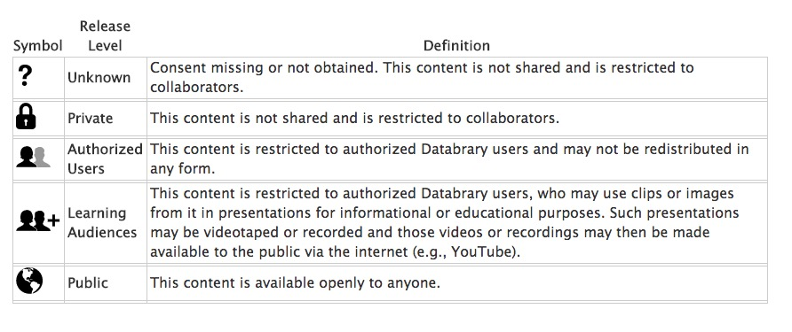

```{r setup, include=FALSE}
knitr::opts_chunk$set(echo = FALSE)
```

<div class="centered">


</br>


</div>

# Agenda

---

### What is Databrary?

### How does it work?

### Strengths

### Weaknesses

### Use cases

### The future...

# What is Databrary?

---


### databrary.org

## A data library

### Specialized for storing, sharing, browsing, and reusing video & audio

### Store and share session (person + place + time) metadata

## Policy framework for securely sharing identifiable data

### Videos are identifiable

---

## Restrict access: To researchers formally authorized by their institutions

### Access agreement signed by researcher, institution

## Store for research team use; preservation

## Share with other researchers only with permission

---



<https://www.databrary.org/resources/guide/investigators/release/release-levels.html>

# How does it work?

## Register for access

### Databrary staff get in touch
### Institution signs [Databrary Access Agreement](https://www.databrary.org/resources/agreement.html)

## Browsing

### Log on
### Search, filter, play
### Most teaching & pre-research use cases do not require IRB approval

## Sharing data

### Upload as-as-you go ("self-curate")
### Add metadata, links to other resources
### Give collaborators access
### Share when you're ready (paper goes to press, grant ends)

## Secondary (re)use

### Get IRB approval
### Search, filter
### Download
### Code & use videos

# Strengths & weaknesses

## Strengths

### Large-scale secure cloud storage
### Open sharing with restricted community of researchers
### Consistent permission framework

## Weaknesses

### Doesn't just "sync"" with cloud storage (e.g. Box, Dropbox, etc.)
### Manual entry of metadata
### New (~4 years old), only 20% of data are shared; limited scope

# Use cases

## Teaching

[Searching for teaching clips](https://nyu.databrary.org/search?offset=0&volume&f.content_type=excerpt)

## Pre-research

<video controls>
  <source src="https://nyu.databrary.org/slot/9830/-/asset/11439/download?inline=true" type="video/mp4">
</video>

Bertenthal, B.I. (2014). Biological Motions. Databrary. Retrieved January 29, 2018 from http://doi.org/10.17910/B7W884.

## Sharing research products beyond publications

Adolph, K., Tamis-LeMonda, C. & Gilmore, R.O. (2016). PLAY Project: Materials. Databrary. Retrieved January 25, 2018 from https://nyu.databrary.org/volume/254.

## Repurposing shared data

Jayaraman, S., Smith, L.B., Raudies, F. & Gilmore, R.O. (2014). Natural Scene Statistics of Visual Experience Across Development and Culture. Databrary. Retrieved January 25, 2018 from <http://doi.org/10.17910/B7988V>.

# The future

## Domains beyond developmental psychology

## From data repository to analysis platform

## Machine-assisted audio & video analysis

## Video as research documentation


</a>

[Gilmore & Adolph 2017](http://doi.org/10.1038/s41562-017-0128)

# Thank you

---

### rogilmore@psu.edu

### [gilmore-lab.github.io](http://gilmore-lab.github.io)

### [github.com/databrary](http://github.com/databrary)

### Datavyu video coding tool, [datavyu.org](http://datavyu.org)

---

This talk was produced on `r Sys.time()` in [RStudio 1.1.383](http://rstudio.com) using R Markdown and the reveal.JS framework.
The code and materials used to generate the slides may be found at <https://github.com/gilmore-lab/2018-01-31-software-in-humanities/>. 
Information about the R Session that produced the slides is as follows:

---

```{r session-info}
sessionInfo()
```
